# Balatro Mod Development FAQ

This FAQ covers frequently used fields, functions and pieces of code for Balatro mod development that are either not covered by the Vanilla examples in the main repository or that might not be entirely clear from the implementation.

## General Development

### How do I start making Balatro mods?

> [!NOTE]
> This is _not_ meant to be a tutorial on how to make Balatro mods but rather advice on how to set up your environment for developing mods.

#### 1. Install Lovely and SMODS

If you haven't already, install [Lovely](https://github.com/ethangreen-dev/lovely-injector) and [smods](https://github.com/Steamodded/smods) by following the [instructions here](https://github.com/Steamodded/smods/wiki).

It is recommended to have both updated at all times while developing as they release new features and bugfixes all the time.

You will know they're installed properly once you see the "Mods" button on the main menu and the SMODS version in the corner.

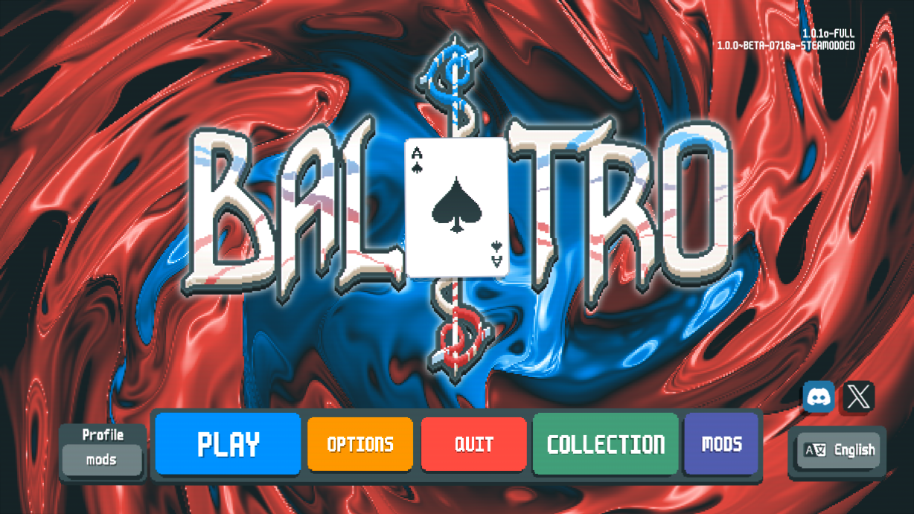

#### 2. Install a code editor

You can use whatever editor you're most comfortable with, but if you're a beginner I highly _highly_ recommend using [VSCode](https://vscodium.com/). The rest of this section will have tips for VSCode but those should still apply to a lot of different editors. Please don't use notepad.

> [!NOTE]
> You don't need to be able to run a Lua interpreter manually for Balatro modding. All testing will be done through the game.

#### 3. Set up the Lua LSP

The Language Server Protocol, or LSP for short, enables features such as code completion, syntax highlighting and error markers.

[Follow the instructions here](https://luals.github.io/#install) to install it in your preferred editor. For VSCode in particular, search for "Lua" and install the [Lua extension by sumneko](https://marketplace.visualstudio.com/items?itemName=sumneko.lua).

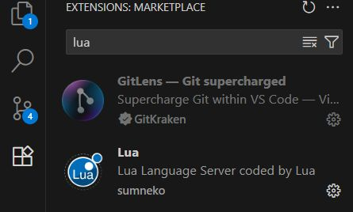

After that, we need to point the editor to the Balatro and SMODS code so we get better completions and less undefined warnings.

To accomplish this in VSCode you can either:

- Open a folder that contains your mod, the `smods` folder and the `lovely/dump` folder (such as opening your entire Mods folder). This is the easiest way but it can lead to your workspace being disorganized and harder to navigate in.

- Set up your workspace settings so they point to those folders. You can do this either by creating a `.luarc.json` file in your mod's folder or by pressing `F1` and searching `Preferences: Open Workspace Settings (JSON)` and adding the following (you can omit `Lua.` when using a luarc file):

```json
{
  "Lua.workspace.library": ["path/to/smods", "path/to/lovely/dump"]
}
```

Optionally, you can also point it to a love2d folder for more definitions or [this project by frostice482](https://github.com/frostice482/balatro-lsp) that adds more descriptions to vanilla code.

#### 4. Basic mod

Now that we have all of that we will set up a quick template mod. First, create a folder for your mod if you haven't already. (I recommend developing directly on your Balatro Mods folder for fast testing.). Open that folder in VSCode.

Create a [metadata file](https://github.com/Steamodded/smods/wiki/Mod-Metadata). For example, `coolbalatro.json`.

It should contain something similar to this.

```json
{
  "id": "MyCoolBalatroMod",
  "name": "My Cool Balatro Mod",
  "author": ["me"],
  "description": "This is my really cool balatro mod. It has XChips and Reverse Tarots.",
  "prefix": "mycoolmod",
  "main_file": "coolbalatro.lua",
  "version": "1.0.0"
}
```

> [!IMPORTANT]
> Make sure that the `id` and `prefix` are unique enough so they don't conflict with other mods. The `prefix` in particular will be used often.

Then we will set up the main file we will be developing in. File organization will be covered in a later question.

Create the file listed in `main_file`, in this case `coolbalatro.lua`. Then we will use the Joker code from VanillaRemade with some modifications to add text without a localization file using `loc_txt`.

```lua
-- Joker
SMODS.Joker {
    key = "joker",
    pos = { x = 0, y = 0 },
    rarity = 1,
    blueprint_compat = true,
    cost = 2,
    discovered = true,
    config = { extra = { mult = 4 }, },
    loc_txt = {
        name = "Joker",
        text = {
            "{C:red,s:1.1}+#1#{} Mult",
        },
    },
    loc_vars = function(self, info_queue, card)
        return { vars = { card.ability.extra.mult } }
    end,
    calculate = function(self, card, context)
        if context.joker_main then
            return {
                mult = card.ability.extra.mult
            }
        end
    end
}
```

Make sure to save often!

Now open the game and you should see your mod in the Mods menu.

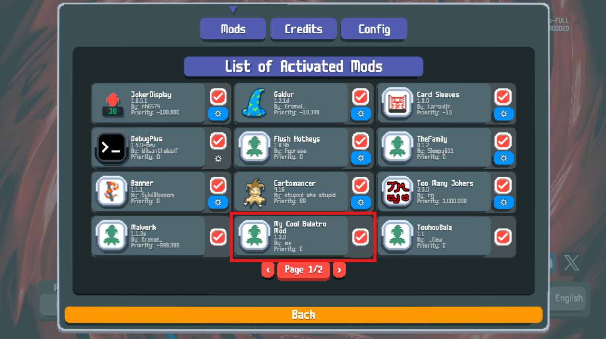

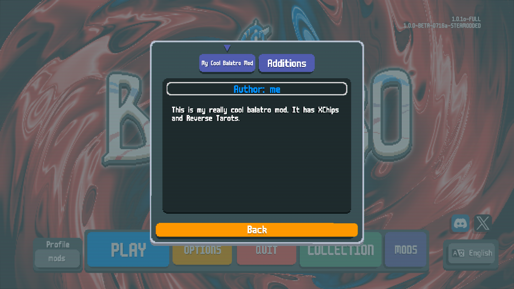

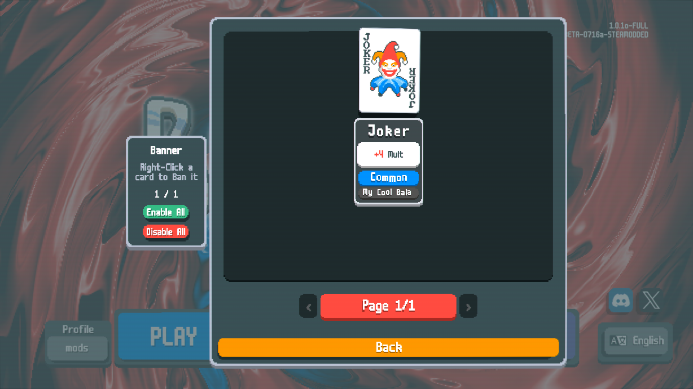

#### 5. Set up version control

When developing any software, version control is the most important aspect. This will be an extremely short guide on how to set up a git repository on GitHub using VSCode features but I highly recommend searching a tutorial on how to use git, especially if you're planning to continue to develop in the future.

First, [install git](https://git-scm.com/downloads) and create a [GitHub account](https://github.com/).

Go to your mod's folder in VSCode (For this, it can't be a folder higher up). Click on the source control tab on the side and click on "Initialize Repository".

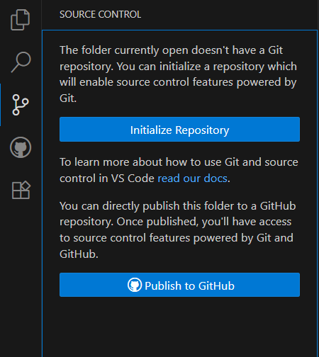

Then you will want to commit your work. Commiting makes it so you "save" a snapshot of how your program looks at this moment so you can go back to it at any time if anything goes wrong. It's important to commit each time you finish a task, no matter how small, and to add a meaningful commit message.

Add a message and press "Commit".

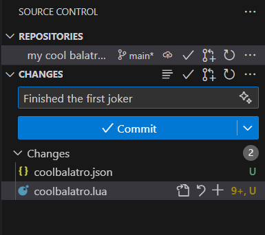

Now press on "Publish Branch".

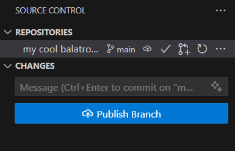

It will ask you to login to GitHub. After you do you will see this menu. You can pick between creating a Public or Private repository. This can be changed later.

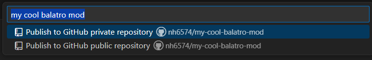

Now if you go to your GitHub profile your repository should be there. Hooray!

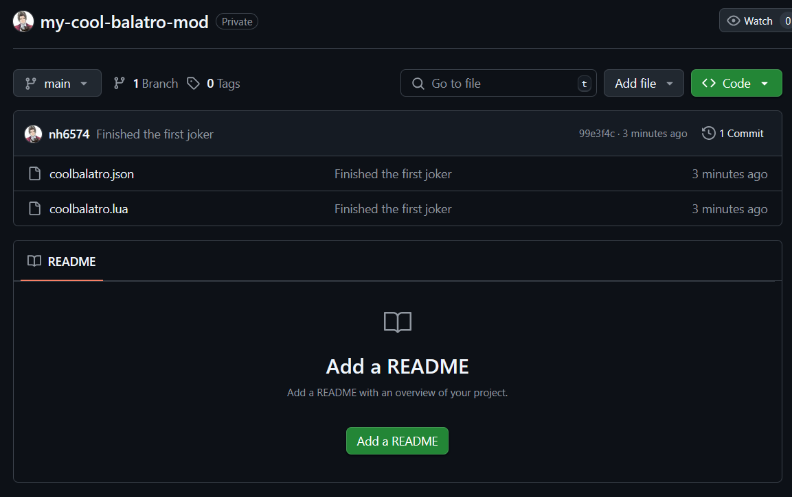

> [!TIP]
> I recommend [setting up a `README.md` file](https://docs.github.com/en/get-started/writing-on-github/getting-started-with-writing-and-formatting-on-github/basic-writing-and-formatting-syntax) with information on your mod (Images are appreciated!) and a `.gitignore` file which can be used to exclude files from your repository, such as the `.luarc.json` file, the `.lovelyignore` file generated by SMODS when disabling the mod or any other reference files.

#### 6. Next steps

That's it, now you're free to go and make your Balatro dreams come true. If you have no idea what to do next, here are a couple of things to look into:

- [SMODS' Your First Mod](https://github.com/Steamodded/smods/wiki/Your-First-Mod) - Collection of resources for developing your first mod.
- [Programming in Lua](https://www.lua.org/pil/contents.html) - Recommended in the previous link but worth restating. You will need at least some basic Lua knowledge to develop mods.
- [SMODS Documentation](https://github.com/Steamodded/smods/wiki/API-Documentation) - Crucial resource when developing mods. Always have this on hand.
- [VanillaRemade](https://github.com/nh6574/VanillaRemade) - You're here right now, hi! The main repository contains all vanilla objects recreated using SMODS to use as a reference. If you can think of a similar effect in the main game, just reference the relevant code.
- [Lovely Documentation](https://github.com/ethangreen-dev/lovely-injector?tab=readme-ov-file#patches) - Documentation on Lovely patches.
- Other mods - If you know of a similar effect in another mod, most devs won't have a problem with you taking inspiration from their code. Try to be polite and ask for permission first though!
- [Balatro Discord Server](https://discord.com/invite/balatro) - The #modding-dev channel is very helpful and friendly when it comes to helping with mod development, come and ask questions! You might even see me there! Don't say hi though, I'm very timid (laughs).
- [Balatro Modding Starter Pack](https://discord.com/channels/1116389027176787968/1349064230825103441) - This specific thread in the official Balatro server contains a lot of resources to further help with development.
- Balatro's source code - If you need to recreate something that's not in VanillaRemade (or you want to specifically see the original workings), you should look at the game's source code directly. You can either access it from the `lovely/dump` folder from earlier, which contains any lovely patches done by SMODS or other mods, or by unzipping the Balatro.exe (or equivalent distribution file). Please don't redistribute the code anywhere or bother LocalThunk with any findings in the code.

### Do I need to know Lua to mod the game?

Yes, at least at a basic level.

While for the most part the code will be pretty simple, thanks to the SMODS API abstractions, if you don't have some understanding about what a for loop is or how to index a table then you might struggle. I recommend reading the recommendations above and looking up some YouTube tutorials. Keep in mind Balatro uses [`LuaJIT`](https://luajit.org/luajit.html) which in turn uses [`Lua 5.1`](https://www.lua.org/manual/5.1/) syntax, so newer features might not work.

If you really don't want to learn, try [Joker Forge](https://jokerforge.jaydchw.com/).

### What's a patch?

A Lovely patch allows you to add code in the middle of the original game's code.

Let's say you want to make an effect that prevents the deck from being shuffled before a Blind while a specific Joker is held.
This is done in this part of the code:

```lua
-- functions/state_events.lua
-- function new_round()

G.E_MANAGER:add_event(Event({
    trigger = 'immediate',
    func = function()
        G.STATE = G.STATES.DRAW_TO_HAND
        G.deck:shuffle('nr'..G.GAME.round_resets.ante)
        G.deck:hard_set_T()
        G.STATE_COMPLETE = false
        return true
    end
}))

-- (Keep in mind that in a real application you would probably need to patch the shuffle after a cash out as well).
```

Because this is in a middle of an event, it's hard to reach the code in other ways such as a hook.

A basic Lovely patch looks like this:

```toml
[manifest] # Header for the file, this should only be here once at the beginning
version = "0.1.0"
priority = 0 # Priority for loading the file

[[patches]]
[patches.pattern]
target = 'functions/state_events.lua' # The file you want to patch.
pattern = '''
G.deck:shuffle('nr'..G.GAME.round_resets.ante)
''' # The line(s) you want to patch. In pattern patches it should be the whole line(s). Make sure it's unique in that file.
position = "at" # Where you want to patch it: 'before', 'after' or 'at' (this last one replaces the whole pattern)
payload = '''
if not next(SMODS.find_card("j_modprefix_key")) then
    G.deck:shuffle('nr'..G.GAME.round_resets.ante)
end
''' # What code you want to replace it with.
match_indent = true
```

After that the original code will look like this (You can see it in you Mods folder's `lovely/dump`):

```lua
-- functions/state_events.lua
-- function new_round()

G.E_MANAGER:add_event(Event({
    trigger = 'immediate',
    func = function()
        G.STATE = G.STATES.DRAW_TO_HAND
        if not next(SMODS.find_card("j_modprefix_key")) then
            G.deck:shuffle('nr'..G.GAME.round_resets.ante)
        end
        G.deck:hard_set_T()
        G.STATE_COMPLETE = false
        return true
    end
}))
```

You can also patch other mods:

```toml
# Add context when a card retriggers
# Credit: Somethingcom515
[[patches]]
[patches.pattern]
target = '=[SMODS _ "src/utils.lua"]' # This patches SMODS code but you can replace _ for the ID of the mod you want to patch.
pattern = '''effect.message = effect.message or (not effect.remove_default_message and localize('k_again_ex'))'''
position = "after"
payload = '''
effect.extra = {func = function() SMODS.calculate_context({vremade_card_retriggered = true}) end}
'''
match_indent = true
```

Read the [Lovely documentation](https://github.com/ethangreen-dev/lovely-injector?tab=readme-ov-file#patches) for more info.

### What's a hook?

A hook is a less intrusive way to add extra functionality to functions than patches. This is recommended in most situations.

This is how a hook is structured:

```lua
-- First we save the original function to a local variable
-- This will also save any other hooks made before
local card_add_to_deck_ref = Card.add_to_deck
-- Then we make another function with the same parameters as the original
-- As a reminder, this is equivalent to `function Card.add_to_deck(self, from_debuff)`
function Card:add_to_deck(from_debuff)

    -- Here we optionally add any code we want to run before the function
    print("Doing something before the original code")

    -- We then run the original and save its return to a variable
    -- (The arguments, in this case `self` and `from_debuff`, can be modified by your code if necessary)
    -- Keep in mind the original function could also have multiple return values.
    local ret = card_add_to_deck_ref(self, from_debuff)

    -- Here we optionally add any code we want to run after the function
    print("Doing something after the original code")

    -- Finally we return the original return.
    -- (`ret` can be modified by your code if necessary)
    return ret
end
```

Now any code that calls Card.add_to_deck in vanilla or mods will actually be calling your function (which in turn calls the original).

For example, let's say we want to keep a global counter of every Joker added.

```lua
local card_add_to_deck_ref = Card.add_to_deck
function Card:add_to_deck(from_debuff)
    local ret = card_add_to_deck_ref(self, from_debuff)

    if not from_debuff and -- If the card wasn't added by being undebuffed
        self.ability.set == "Joker" then -- and the card (`self` in this case) is a Joker

        -- Adds it to the run's global table.
        -- It is recommended (but optional) to preppend your mod's prefix to any global variable/field to prevent mod conflicts
        G.GAME.vremade_joker_added_counter = (G.GAME.vremade_joker_added_counter or 0) + 1
    end

    return ret
end
```

### How do I debug my code?

[DebugPlus](https://github.com/WilsontheWolf/DebugPlus) is highly recommended for mod development. It enables the game's debug menu while adding a bunch of extra functionality.
This allows you to, among other things: spawn objects (such as Jokers, Tags, etc.); change the boss blind; apply editions, enhancements, seals, etc.; modify game variables like money, hands remaining, etc. or run lua code and see debug prints directly in-game using the console.

Apart form that there's no traditional debugger to help with development. If you make a change in code, you need to restart the whole game for it to take effect (barring some exceptions thanks to DebugPlus features).

> [!TIP]
> You can restart the game faster by pressing `alt + f5` or holding `m`.

It is also recommended then to add debug prints if your code isn't working as intended.

Let's say you want to find out why this code is not working.

```lua
-- Each scored 10 gives 50 chips
calculate = function(self, card, context)
    if context.individual and context.cardarea == G.play then
        print("The rank of the card is: " .. context.other_card.base.value) -- We add a debug print to check the rank
        if context.other_card.base.value == "Ten" then
            return {
                chips = 50
            }
        end
    end
end,
```

If we play a 10 we can see what we did wrong: the key for the rank 10 is `'10'` and not `'Ten'`

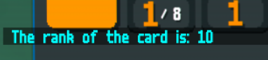

> [!IMPORTANT]
> When changing the object's `config` (or anything that would for example be saved to `card.ability`) it's important to get a new instance of the object if possible. Although it is always recommended to start a new run instead.
> See [this question](#why-does-my-card-crash-when-i-change-its-config) for details.

### How do I organize my files?

The code can be organized however you want with the following exceptions.

- Your root folder should contain a metadata `.json` file and a main `.lua` file the metadata points to.
  - The main file can be in a subfolder.
- Localization files must be located in `localization/[language code].lua`.
- Lovely patches must be in a file called `lovely.toml` in your root folder or organized in a `lovely/` folder (recommended).
- Spritesheets must be in `assets/1x` and `assets/2x` with the same file name.
- Other assets such as sounds, shaders or fonts must be in `assets/sounds`, `assets/shaders` and `assets/fonts` respectively.

So your basic structure should look like this (assuming you're using all the features):

```text
Mods
└──MyModFolder
    ├── MyCoolMainFile.lua
    ├── MyCoolMetadata.json
    ├── lovely
    │   ├── patches.toml
    │   ├── other_patches.toml
    │   └── ...
    ├── localization
    │   ├── en-us.lua
    │   ├── es_419.lua
    │   └── ...
    └── assets
        ├── 1x
        │   ├── joker_sprites.png
        │   ├── tarots.png
        │   └── ...
        ├── 2x
        │   ├── joker_sprites.png
        │   ├── tarots.png
        │   └── ...
        ├── sounds
        │   ├── cool_explosion.ogg
        │   ├── pokemon_cry.ogg
        │   └── ...
        ├── shaders
        │   ├── negative_but_worse.fs
        │   ├── uglyshader.fs
        │   └── ...
        └── fonts
            ├── wingdings.ttf
            ├── comicsans.ttf
            └── ...
```

If we need to load other code files, we need to do so manually from our main file like this:

```text
Mods
└──MyModFolder
    ├── MyCoolMainFile.lua
    ├── MyCoolMetadata.json
    ├── jokers.lua
    └── src
        └── config.lua
```

```lua
-- In MyCoolMainFile.lua
assert(SMODS.load_file("jokers.lua"))()
assert(SMODS.load_file("src/config.lua"))()
```

Here's a snippet to load all files from a subfolder:

```lua
-- In your main file.
-- This will load any file in the `jokers/` subfolder
-- Note: Load order is not guaranteed
local jokers_src = NFS.getDirectoryItems(SMODS.current_mod.path .. "jokers")
for _, file in ipairs(jokers_src) do
    assert(SMODS.load_file("jokers/" .. file))()
end
```

### How do I make a texture pack?

For playing card textures (collabs) check out [`SMODS.DeckSkin`](https://github.com/Steamodded/smods/wiki/SMODS.DeckSkin). You can find [an example here](https://github.com/Steamodded/examples/tree/master/Mods/DeckSkinTemplate).

For other kinds of textures use the [Malverk](https://github.com/Eremel/Malverk/tree/main) mod.

### How do I change localization for vanilla/other mods' objects?

Simply make a localization file and use the keys for what you want to localize.

```lua
return {
    descriptions = {
        Joker = {
            j_joker = {
                name = "Jimbo",
                text = {
                    "+#1# funny crazy mult"
                },
            }
        }
    }
}
```

## Terminology

### What's a `front`/`center`/`back`?

These terms are derived from the way the card sprites are set up.

- The `front` of a card is the sprite for the playing card's rank and suit. This combination of rank and suit is called the `Front` as well in the code.
- The `center` of a card is the the playing card's base sprite which changes with enhancements. This is also the main sprite for all other card types such as Jokers, Consumables, Vouchers, Boosters, etc. Because the center sprite shows what "ability" the card has, regardless of type, all these objects mentioned are considered `Centers`.
  - Although this is not limited to the center sprite. Editions, Decks and some other objects are also considered Centers.
- The `back` sprite of a card when its flipped face-down represents the deck it came from. This is why Decks are called `Backs` in the code.

### What's a `pool`/`set`?

`pools` are collections of objects registered and available to be created such as Consumables, Blinds, Editions, etc. while `sets` usually refers to the type of a card such as a consumable being a `Tarot` vs `Planet` vs `Spectral`. Sometimes these terms are used interchangeably.

Here are places where important game objects are stored:

```lua
-- The following are tables of prototype objects indexed by key (i.e. `G.P_CENTERS["j_crafty"] contains the information for Crafty Joker)
G.P_CENTERS -- This includes Jokers, Consumables, Vouchers, Backs, Enhancements, Editions and Boosters
G.P_CARDS -- Playing card fronts.
G.P_BLINDS
G.P_STAKES
G.P_TAGS
G.P_SEALS
SMODS.PokerHands
SMODS.Ranks
SMODS.Suits
```

```lua
-- The following are pools indexed by integers (i.e. `G.P_CENTER_POOLS.Joker[1] contains the information for the first Joker in the pool)
G.P_CENTER_POOLS -- Contains pools for each center set.
G.P_CENTER_POOLS.Booster
G.P_CENTER_POOLS.Enhanced -- Enhancements
G.P_CENTER_POOLS.Edition
G.P_CENTER_POOLS.Joker
G.P_CENTER_POOLS.Tarot
G.P_CENTER_POOLS.Planet
G.P_CENTER_POOLS.Tarot_Planet -- Contains both Tarots and Planets
G.P_CENTER_POOLS.Spectral
G.P_CENTER_POOLS.Consumeables -- Contains all consumables, including custom ones
G.P_CENTER_POOLS.Voucher
G.P_CENTER_POOLS.Back
G.P_CENTER_POOLS.Tag
G.P_CENTER_POOLS.Seal
G.P_CENTER_POOLS.Stake
G.P_CENTER_POOLS["ObjectTypeKey"] -- For a custom ObjectType or ConsumableType. Doesn't include the mod prefix.

G.P_JOKER_RARITY_POOLS -- Contains pools for each Joker rarity.
G.P_JOKER_RARITY_POOLS[1] -- Common.
G.P_JOKER_RARITY_POOLS[2] -- Uncommon.
G.P_JOKER_RARITY_POOLS[3] -- Rare.
G.P_JOKER_RARITY_POOLS[4] -- Legendary.
G.P_JOKER_RARITY_POOLS["modprefix_key"] -- For a custom rarity.
```

Additionally, you can use the vanilla `get_current_pool` function to get all cards available in a pool respecting things such as `in_pool` and Showman-like abilities.

See also [how to make your own sets](#how-do-i-create-a-poolset), [how to give a random object from a pool to the player](#how-do-i-give-x-type-of-card-to-the-player) or [how to apply a random modifier](#how-do-i-give-a-card-a-random-enhancementeditionsealetc).

### What are the different card areas called?

These are the different global `CardAreas` used by the game.

```lua
G.jokers -- Main Joker area
G.consumeables -- (sic). Main consumable area
G.hand -- Area for playing cards held in hand
G.play -- Area for playing cards played. Also used for some animations
G.deck -- Area for playing cards currently in the deck
G.discard -- Invisible area playing cards go after being played or discarded. Also used for some animations
G.vouchers -- Voucher area. Added by SMODS
G.shop_jokers -- Main shop area for Jokers, Consumables, Playing Cards, etc.
G.shop_booster -- Shop area for Booster packs
G.shop_vouchers -- Shop area for Vouchers
G.pack_cards -- Area for cards in a booster

G.title_top -- Title screen area

G.playing_cards -- Not an area but a list of every playing card in the full deck regadless of area.
"unscored" -- Value that `context.cardarea` can take in `calculate` to signify cards played but not scored (As G.play is used for scored cards). Added by SMODS
```

You might also want to check [how to get the cards in the area](#how-do-i-get-the-cards-in-an-area).

### What's a class/mod prefix?

Sometimes you might see example code like this:

```lua
if next(SMODS.find_card("j_modprefix_key")) then
    -- only do something if you own a certain joker
end
```

In this case `"j_modprefix_key"` refers to your hypothetical Joker, where `j` is the class prefix, `modprefix` is replaced by your mod's prefix and `key` is the key specified in `SMODS.Joker`. This is to avoid conflicts between objects from different classes7mods.

You can find the prefix for each class at the start of each page in the [SMODS Documentation](https://github.com/Steamodded/smods/wiki/) and you can find your mod's prefix in your JSON metadata.

For example, if your prefix is `joy` and you have an Enhancement with key `hanafuda`, its full key will be `'m_joy_hanafuda'`.

Some classes don't have prefixes and they're registered as `modprefix_key`. `ObjectTypes` and `ConsumableTypes` don't include prefixes by default.

### What's a context?

Each object's `calculate` function is ran every time a specific set of actions occurs with a certain `context`.

For example, `context.open_booster` is called when a booster is opened, `context.setting_blind` is called when selecting a Blind, etc.

A [list of contexts](https://github.com/Steamodded/smods/wiki/Calculate-Functions#contexts) can be found in the SMODS Documentation.

The way to read this documentation is as follows:

```lua
if context.joker_main then
context.cardarea, context.full_hand, context.scoring_hand, context.scoring_name, context.poker_hands
context.joker_main -- boolean value to flag this context, always TRUE
```

Means that you can do this in `calculate`:

```lua
if context.joker_main then
    local is_joker_area = context.cardarea == G.jokers -- Always true in this context
    local number_of_cards_played = #context.full_hand
    local second_scoring_card = context.scoring_hand[2] -- Might be nil, of course
    local is_three_of_a_kind = context.scoring_name == "Three of a Kind"
    local contains_flush = next(context.poker_hands["Flush"])
end
```

Normally, you want your `calculate` structure to look like the following. Doing operations outside of context checks is discouraged, with some exceptions like Blueprint-like effects.

```lua
if context.before then
    -- Do things before scoring
end

-- Here you want the main timing context check (individual) and the cardarea check to come before any other check
-- to avoid problems with nil values and excessive calculations
if context.individual and context.cardarea == G.play and context.other_card.get_id() == 2 then
    -- Do something for every 2 scored
end

if context.modify_scoring_hand then
    -- Do something every time a card is considered for scoring (like Splash)
end

if context.end_of_round and context.main_eval and context.game_over == false then
    -- Do something if you didn't lose at end of round.
    -- (Main eval prevents calculations in context.individual and context.repetitions at end of round)
end
```

> [!NOTE]
> Tags have a completely different set of contexts for the `apply` function. See [Tags in the main repository](https://github.com/nh6574/VanillaRemade/blob/main/src/tags.lua) for examples.

### What are optional features?

Some SMODS features are opt-in to use, in most cases because of excessive calculations. If any mod installed enables any optional feature then it will be enabled for all other mods.

Here's how you would enable all current optional features.

```lua
SMODS.current_mod.optional_features = {
    retrigger_joker = true,
    post_trigger = true,
    quantum_enhancements = true,
    cardareas = {
        discard = true,
        deck = true
    }
}
```

> [!WARNING]
> It is not recommended to enable these features unless you are using them.

#### retrigger_joker

Enables retriggering jokers using `context.retrigger_joker_check`. Example:

```lua
-- Retrigger all common Jokers
if context.retrigger_joker_check and context.other_card:is_rarity(1) then
    return { repetitions = 1 }
end
```

#### post_trigger

Enables calculations after an object is triggered using `context.post_trigger`. Example:

```lua
-- Scales mult by 2 when another Joker gives chips.
if context.post_trigger then
    local other_ret = context.other_ret.jokers or {}
    if other_ret.chips or other_ret.h_chips or other_ret.chip_mod or
    other_ret.x_chips or other_ret.xchips or other_ret.Xchip_mod then
        card.ability.extra.mult = card.ability.extra.mult + 2
        return {
            message = localize { type = 'variable', key = 'a_mult', vars = { 2 } },
            colour = G.C.MULT,
            message_card = card
        }
    end
end
```

#### quantum_enhancements

Enables `context.check_enhancement` which allows effects to treat a playing card as having enhancements it doesn't have.

```lua
-- Makes all 7s be treated as Steel and Gold
if context.check_enhancement and context.other_card.base.value == "7" then
    return {
        m_gold = true,
        m_steel = true
    }
end
```

> [!WARNING]
> Don't use any function that checks for enhancements to avoid an infinite loop, such as `SMODS.has_enhancement` or `card.is_face`.
> Also with this feature enabled you have to be careful with what you do outside strict context checks.

#### cardareas

You can also allow `G.deck` and `G.discard` as optional CardAreas for calculation.

```lua
--- Each card discarded or still in deck gives +1 chips during scoring
if context.individual and (context.cardarea == G.deck or context.cardarea == G.discard) and not context.end_of_round then
    return {
        chips = 1
    }
end
```

## Making new additions

### How do I add the custom art for my cards to my mod?

[Make an `SMODS.Atlas`](https://github.com/Steamodded/smods/wiki/SMODS.Atlas). Example:

```lua
SMODS.Atlas({
    key = "EpicJokers",
    path = "my_epic_joker_spritesheet_final_1.png", -- See 'How do I organize my files?'
    px = 71,
    py = 95
})

SMODS.Joker({
    key = "nagitokomaeda",
    atlas = 'EpicJokers',
    pos = { x = 2, y = 1 }, -- Second row, third column in the spritesheet
})
```

`px` and `py` are the width and height of each individual sprite respectively.
Standard sizes are 71 x 95 for cards and 34 x 34 for Blind chips and tags.

### How can I make my card not appear in the shop/boosters/others?

Using the `in_pool` function in your object. Example:

```lua
-- Prevent the object from being spawned by any random means
in_pool = function(self, args)
    return false
end
```

If you want to, for example, prevent a Joker being spawned by Judgement you can do:

```lua
-- Prevent the object from being spawned by Judgement specifically
in_pool = function(self, args)
    return not args or args.source ~= "jud"
end
```

`args.source` will be what's passed to `key_append` in `SMODS.create_card`.

These are the sources used in vanilla:

```lua
'deck' -- Added at the start of the run by the current deck's config
'sho' -- Shop
'blusl' -- Blue Seal
'fool' -- The Fool
'emp' -- The Emperor
'pri' -- The High Priestess
'jud' -- Judgement
'sou' -- The Soul
'wra' -- Wraith
'ar1' -- Tarots in Arcana Packs
'ar2' -- Spectrals in Arcana Packs
'pl1' -- Celestial Packs
'spe' -- Spectral Packs
'sta' -- Standard Packs
'buf' -- Buffoon Packs
'8ba' -- 8 Ball and Purple Seal
'hal' -- Hallucination
'rif' -- Riff-raff
'car' -- Cartomancer
'sixth' -- Sixth Sense
'vag' -- Vagabond
'sup' -- Superposition
'sea' -- Seance
'top' -- Top-up Tag
'rta' -- Rare Tag
'uta' -- Uncommon Tag
```

### How do I create a `pool`/`set`?

[Make an `SMODS.ObjectType`](https://github.com/Steamodded/smods/wiki/SMODS.ObjectType). Example:

```lua
-- Food pool
SMODS.ObjectType({
    key = "modprefix_Food", -- The prefix is not added automatically so it's recommended to add it yourself
    default = "j_ice_cream",
    cards = {
        j_gros_michel = true,
        j_egg = true,
        j_ice_cream = true,
        j_cavendish = true,
        j_turtle_bean = true,
        j_diet_cola = true,
        j_popcorn = true,
        j_ramen = true,
        j_selzer = true,
    },
})
```

Then you can use `SMODS.add_card{ set = "modprefix_Food", area = G.jokers }` to get a random card from the pool.

`SMODS.ConsumableType` is a subclass of `SMODS.ObjectType` to make new kinds of consumables. Check the [VanillaRemade implementation of vanilla consumables](https://github.com/nh6574/VanillaRemade/blob/3d719c5647c3e053c994ca8999dc19dfa3181925/src/tarots.lua#L3) for an example.

See also [what's a `pool` or `set`](#whats-a-poolset) and [how to get a pool](#how-do-i-get-the-set-pool-or-key-of-a-specific-cardobject).

## Variables

### How do I check if a playing card has a specific suit/rank?

```lua
local card_id = playing_card:get_id() == 13 -- Ranks 2-10 are IDs 2-10, Jack is 11, Queen is 12, King is 13, Ace is 14. Respects enhancements
local card_rank_key = playing_card.base.value == "King" -- Gets the ranks as a key. Modded ranks are "modprefix_key". Doesn't respect enhancements
local is_hearts = playing_card:is_suit("Hearts") -- This respects enhancements
local card_suit = playing_card.base.suit == "Hearts" -- Gets the suit as a key. Modded suits are "modprefix_key". Doesn't respect enhancements

-- There are also checks for enhancement modifiers
local has_no_rank = SMODS.has_no_rank(playing_card)
local has_no_suit = SMODS.has_no_suit(playing_card)
local has_any_suit = SMODS.has_any_suit(playing_card)
```

### How do I get if a card has a specific edition/enhancement/seal/sticker?

```lua
-- Edition
local has_edition = card.edition -- nil if it doesn't have one
local is_foil = card.edition and card.edition.key == "e_foil"

-- Enhancement
local has_enhancement = next(SMODS.get_enhancements(card)) -- nil if it doesn't have one. This respects quantum enhancements
local is_lucky = SMODS.has_enhancement(card, "m_lucky") -- This respects quantum enhancements
local is_stone = card.config.center.key == "m_stone" -- This doesn't respect quantum enhancements

-- Seal
local has_seal = card.seal -- nil if it doesn't have one
local is_red_seal = card.seal == "Red"

-- Sticker
local is_rental = card.ability.rental
local is_perishable = card.ability.perishable
local is_eternal = SMODS.is_eternal(card, trigger) -- Allows using `context.check_eternal`. `trigger` is the card or effect that runs the check
local is_eternal_alt = card.ability.eternal -- Doesn't respect `context.check_eternal`
local is_modded = card.ability.modprefix_key -- For modded stickers
```

### How do I get the `set`, `pool` or `key` of a specific card/object?

```lua
-- For Centers
local key = card.config.center.key -- also `card.config.center_key`

local set = card.ability.set
local is_joker = card.ability.set == "Joker"
local is_tarot = card.ability.set == "Tarot"
local is_planet = card.ability.set == "Planet"
local is_spectral = card.ability.set == "Spectral"
local is_voucher = card.ability.set == "Voucher"
local is_booster = card.ability.set == "Booster"
local is_base_playing_card = card.ability.set == "Default"
local is_enhanced_playing_card = card.ability.set == "Enhanced"

local is_part_of_object_type = (card.config.center.pools or {}).modprefix_Food -- See "How do I create a `pool`/`set`?""

-- For Blinds
local blind = G.GAME.blind -- current blind
local key = blind.config.blind.key

-- For Decks
local deck = G.GAME.selected_back -- current deck
local key = deck.effect.center.key

-- For Challenges
local key = G.GAME.challenge -- nil if none

-- For Stakes
local key = G.P_CENTER_POOLS.Stake[G.GAME.stake].key

-- For Tags
local key = tag.config.tag.key
```

### How do I get if the player has a certain card?

For Jokers, Consumables, Vouchers and any other card in a Joker-like area:

```lua
if next(SMODS.find_card("j_splash")) then -- If player has Splash
    -- do code
end

for _, hermit in ipairs(SMODS.find_card("c_hermit")) do -- For each copy of The Hermit
    -- do code
end
```

For Playing Cards you would need to loop through the area and check manually for what you want. Examples:

```lua
-- Example 1:
if context.joker_main then -- In `calculate`
    for _, playing_card in ipairs(context.scoring_hand) do -- For each card in the scoring hand
        if playing_card:get_id() == 14 and playing_card:is_suit("Spades") then -- If it's an Ace of Spades
            -- do code
        end
    end
end

-- Example 2:
for _, playing_card in ipairs(G.deck.area) do -- For each card in remaining in deck
    if playing_card:has_enhancement("m_steel") then -- If it's a Steel card
        -- do code
    end
end
```

### How do I get a random number/element?

```lua
-- For these examples we use a string to set the seed, the exact value is not important as long as its unique
-- It's recommended for it to include the mod prefix. You can also append G.GAME.round_resets.ante to make the seed unique each ante, for example

local random_number = pseudorandom("modprefix_my_unique_seed") -- Random floating point number between 0 and 1
local random_number_from_min_to_max = pseudorandom("modprefix_another_seed", 4, 34) -- Random number from min to max (inclusive). 4 to 34 in this case

local list = { "hi", 3, "bye" }
local random_element, index_in_the_list = pseudorandom_element(list, "modprefix_seed") -- You can also ignore the index
pseudoshuffle(list, "modprefix_shuffle") -- You can also shuffle the list
```

> [!Important]
> If you want to get an effect with a random chance (i.e. affected by Oops! All 6s), [check how Cavendish does it instead](https://github.com/nh6574/VanillaRemade/blob/main/src/jokers.lua) using `SMODS.pseudorandom_probability`.

### How do I get the cards in an area?

`CardArea.cards` contains the list of cards currently in the area.

For example if we want to get the number of jokers owned we would check `#G.jokers.cards`. Keep in mind that during scoring you will need to [add the respective buffer](#whats-joker_bufferconsumeable_bufferdollar_buffer) to get the real amount.

If you want to iterate through all the cards in the area you would do something like:

```lua
for index, consumable in ipairs(G.consumeables.cards) do
    -- your code
end
```

Keep in mind, `G.playing_cards` is not a `CardArea` so to get the length and iterate we would just do:

```lua
local card_count = #G.playing_cards

for index, playing_card in ipairs(G.playing_cards) do
    -- your code
end
```

### How do I check/change an area's card limit?

To check:

```lua
local area_limit = area.config.card_limit

-- Example:
local consumable_limit = G.consumeables.config.card_limit
```

To change size:

```lua
area:change_size(mod)

-- Example:
G.jokers:change_size(-1) -- Remove 1 Joker slot
```

### How do I get the current amount of money?

```lua
local current_money = G.GAME.dollars
```

### What's `joker_buffer`/`consumeable_buffer`/`dollar_buffer`?

During scoring, due to the timing of events, some things are not updated properly despite it seeming like it is during the animation.

This is why we use the buffer to temporarily update the count before the animation ends.

If we need to get the real amounts during scoring we would do:

```lua
local joker_count = #G.jokers.cards + G.GAME.joker_buffer
local consumable_count = #G.consumeables.cards + G.GAME.consumeable_buffer
local money_count = G.GAME.dollars + G.GAME.dollar_buffer
```

If we are adding jokers, consumables or money then we need to update and then reset these values ourselves.
Here are some examples from the main VanillaRemade repository:

```lua
--- Update and reset dollar buffer
--- From Business Card
G.GAME.dollar_buffer = (G.GAME.dollar_buffer or 0) + card.ability.extra.dollars
return {
    dollars = card.ability.extra.dollars,
    func = function()
        -- This is for timing purposes, this goes after the dollar modification
        -- It resets the buffer in an event after scoring
        G.E_MANAGER:add_event(Event({
            func = function()
                G.GAME.dollar_buffer = 0
                return true
            end
        }))
    end
}
```

```lua
--- Update and reset joker buffer
--- Riff-raff
local jokers_to_create = math.min(card.ability.extra.creates,
    G.jokers.config.card_limit - (#G.jokers.cards + G.GAME.joker_buffer))
G.GAME.joker_buffer = G.GAME.joker_buffer + jokers_to_create
G.E_MANAGER:add_event(Event({
    func = function()
        for _ = 1, jokers_to_create do
            SMODS.add_card {
                set = 'Joker',
                rarity = 'Common',
                key_append = 'vremade_riff_raff'
            }
            G.GAME.joker_buffer = 0
        end
        return true
    end
}))
```

### How can I get the localized name of \[X\]?

```lua
local suit_singular = localize(key, 'suits_singular')
local suit_plural = localize(key, 'suits_plural')
local rank = localize(key, 'ranks')
local poker_hand = localize(key, 'poker_hands')

-- For most other objects
local name = localize { type = 'name_text', set = obj_set, key = obj_key } -- Replace `obj_set` and `obj_key` for the set and key of your object
-- See also `How do I get the `set`, `pool` or `key` of a specific card/object?`
```

### How do I get the current hand's chips/mult?

```lua
-- Only during scoring
local current_hand_chips = hand_chips
local current_hand_mult = mult
```

### How do I get the current scored chips or Blind requirement?

```lua
local current_score = G.GAME.chips
local current_requirements = G.GAME.blind.chips
```

### How do I check if the score is on fire?

```lua
-- Only during scoring
if SMODS.calculate_round_score() > G.GAME.blind.chips then
    -- do code
end

-- Or in context.after
if SMODS.last_hand_oneshot then
    -- do code
end
```

### How do I get the most played hand?

```lua
-- Similar to The Ox
local _handname, _played = 'High Card', -1
for hand_key, hand in pairs(G.GAME.hands) do
    if hand.played > _played then
        _played = hand.played
        _handname = hand_key
    end
end
local most_played = _handname
```

### How do I get the planet card for a specific hand?

```lua
local handname = context.scoring_name -- As an example, it can be any poker hand key
local planet
for _, center in pairs(G.P_CENTER_POOLS.Planet) do
    if center.config.hand_type == handname then
        planet = center.key
    end
end
local planet_for_handname = planet -- Might be nil with mods
```

### How do I get the type of the current Blind?

```lua
local blind_type = G.GAME.blind:get_type()
local is_small = blind_type == "Small"
local is_big = blind_type == "Big"
local is_boss = blind_type == "Boss"
local is_boss_alt = G.GAME.blind.boss
local is_showdown_boss = G.GAME.blind.config.blind.boss.showdown -- i.e. Ante 8 boss
```

### How do I get if the player is in a Blind?

```lua
local is_in_blind = G.GAME.blind.in_blind
```

### How do I get if the player is in a shop?

```lua
local is_in_shop = G.STATE == G.STATES.SHOP
```

### How do I get if a card is face-up/down?

```lua
local is_faceup = card.facing == "front"
local is_facedown = card.facing == "back"
```

### How do I check if a card/object is from a mod?

```lua
-- For Centers
local mod = card.config.center.original_mod

-- For Blinds
local blind = G.GAME.blind -- current blind
local mod = blind.config.blind.original_mod

-- For Decks
local deck = G.GAME.selected_back -- current deck
local mod = deck.effect.center.original_mod

-- For Stakes
local mod = G.P_CENTER_POOLS.Stake[G.GAME.stake].original_mod

-- For Tags
local mod = tag.config.tag.original_mod

-- You can check the mod id
local is_vremade = mod.id == "VanillaRemade"
```

### How do i get the current play/discard/highlight limit?

```lua
local play_limit = G.GAME.starting_params.play_limit
local discard_limit = G.GAME.starting_params.discard_limit
local highlight_selection_limit = G.hand.config.highlighted_limit
```

## Miscellaneous effects

### How do I give \[X\] type of card/object to the player?

#### Jokers/Consumables/Custom Pool

```lua
SMODS.add_card{ -- For a random one
    set = "Joker" -- You can use a custom pool/ObjectType. See `What's a pool/set?`
    key_append = "modprefix_append" -- Optional, key for randomization/pool checking
}
SMODS.add_card{ key = "c_fool" } -- For a specific one
```

#### Playing Cards

```lua
SMODS.add_card{ -- For a random one
    set = "Playing Card" -- For a random chance of being enhanced
    key_append = "modprefix_append", -- Optional, key for randomization/pool checking
    area = G.deck -- Optional, defaults to the hand
}

SMODS.add_card{ -- Random unenhanced Ace
    set = "Base"
    key_append = "modprefix_append", -- Optional, key for randomization/pool checking
    rank = "Ace"
}

SMODS.add_card{ -- Random enhanced 3 of Clubs
    set = "Enhanced"
    key_append = "modprefix_append", -- Optional, key for randomization/pool checking
    rank = "3",
    suit = "Clubs"
}
```

#### Tags

```lua
--- Credits to Eremel
local tag_pool = get_current_pool('Tag')
local selected_tag = pseudorandom_element(tag_pool, 'modprefix_seed')
local it = 1
while selected_tag == 'UNAVAILABLE' do
    it = it + 1
    selected_tag = pseudorandom_element(tag_pool, 'modprefix_seed_resample'..it)
end
add_tag(Tag(selected_tag, false, 'Small')) -- Ignore the previous code and just use a key for a prefined tag
```

#### Voucher

```lua
--- Credits to Eremel <3
local voucher_pool = get_current_pool('Voucher')
local selected_voucher = pseudorandom_element(voucher_pool, 'modprefix_seed')
local it = 1
while selected_voucher == 'UNAVAILABLE' do
    it = it + 1
    selected_voucher = pseudorandom_element(voucher_pool, 'modprefix_seed' .. it)
end
local voucher_card = SMODS.create_card({ area = G.play, key = selected_voucher }) -- Ignore the previous code and just use a key for a prefined voucher
local prev_state = G.STATE
voucher_card:start_materialize()
voucher_card.cost = 0
G.play:emplace(voucher_card)
delay(0.8)
G.FUNCS.use_card({ config = { ref_table = voucher_card } })

G.E_MANAGER:add_event(Event({
    trigger = 'after',
    delay = 0.5,
    func = function()
        voucher_card:start_dissolve()
        return true
    end
}))
```

### How do I give a card a random Edition/Enhancement/Seal?

#### Edition

```lua
local random_edition = SMODS.poll_edition { key = "modprefix_seed", guaranteed = true, no_negative = true } -- Will guarantee a random non-negative edition. See `SMODS.Edition` docs for more details.

SMODS.add_card { set = "Joker", edition = random_edition } -- Add a card with an edition
card:set_edition(random_edition) -- Set an edition on an existing card

-- Jokers might already have a random edition if using `create_card`/`SMODS.create_card`/`SMODS.add_card`
-- To prevent this do:
SMODS.add_card { set = "Joker", no_edition = true }
```

#### Enhancement

```lua
SMODS.add_card { set = "Enhanced" } -- Add a card with an enhancement

local random_enhancement = SMODS.poll_enhancement {key = "modprefix_seed", guaranteed = true} -- See SMODS Utility docs for more details
card:set_ability(random_enhancement) -- Set an enhancement on an existing card
```

#### Seal

```lua
local random_seal = SMODS.poll_seal {key = "modprefix_seed", guaranteed = true} -- See SMODS Utility docs for more details

SMODS.add_card { set = "Playing Card", seal = random_seal } -- Add a card with a seal
card:set_seal(random_seal) -- Set a seal on an existing card
```

### How do I change a card into another?

```lua
-- Transform any card into Cavendish
card:set_ability("j_cavendish")
```

### How do I immediately win a Blind?

```lua
G.E_MANAGER:add_event(Event({
    blocking = false,
    func = function()
        if G.STATE == G.STATES.SELECTING_HAND then
            G.GAME.chips = G.GAME.blind.chips
            G.STATE = G.STATES.HAND_PLAYED
            G.STATE_COMPLETE = true
            end_round()
            return true
        end
    end
}))
```

### How do I immediately win/lose the run?

Win the run:

```lua
win_game()
G.GAME.won = true
```

Lose the run:

```lua
-- Credits to Winter <3
G.STATE = G.STATES.GAME_OVER
if not G.GAME.won and not G.GAME.seeded and not G.GAME.challenge then
    G.PROFILES[G.SETTINGS.profile].high_scores.current_streak.amt = 0
end
G:save_settings()
G.FILE_HANDLER.force = true
G.STATE_COMPLETE = false
```

### How do I change the Blind's requirement in the middle of a Blind?

```lua
-- Reduce blind's requirement by 50%
G.GAME.blind.chips = math.floor(G.GAME.blind.chips - G.GAME.blind.chips * 0.5)
G.GAME.blind.chip_text = number_format(G.GAME.blind.chips)
```

### How do I change the amount of chips scored in the middle of a Blind?

```lua
-- Adds 500 chips to the score
G.GAME.chips = G.GAME.chips + 500
```

### How do I change the amount of chips and mult about to be scored by the current hand?

```lua
-- During scoring
-- Set Chips to 1 and adds 20 to mult
hand_chips = mod_chips(1)
mult = mod_mult(mult + 20)
```

### How do I destroy cards?

```lua
--- Method 1
--- For playing cards while scoring/discarding
if context.destroy_card then
    if context.cardarea == G.hand and context.destroy_card:is_suit("Diamonds") then -- If it's a Diamond held in hand
        return { remove = true }
    end
end
```

```lua
--- Method 2
--- For anything else
SMODS.destroy_cards(card) -- Singular card

SMODS.destroy_cards(G.jokers.cards) -- Can take multiple cards
```

### How do I level up a hand?

```lua
SMODS.upgrade_poker_hands({hands = {"Three of a Kind"}, level_up = 3, from = card}) -- Level up Three of a Kind by 3
```

### How do I copy multiple cards at once?

```lua
--- Copy Jokers to the left and right
-- In `calculate`
local current_index

for i = 1, #G.jokers.cards do
    if G.jokers.cards[i] == card then
        current_index = i
        break
    end
end

local left_ret = SMODS.blueprint_effect(card, G.jokers.cards[current_index - 1], context)
local right_ret = SMODS.blueprint_effect(card, G.jokers.cards[current_index + 1], context)

return SMODS.merge_effects { left_ret or {}, right_ret or {} } -- Can add as many calculate returns as you want
```

### How do I add exponential mult/chips?

SMODS doesn't support exponential or higher operations of score by default, this is implemented by the [Cryptlib](https://github.com/SpectralPack/Cryptlib) and [Talisman](https://github.com/SpectralPack/Talisman) mods.

```lua
--- Thank you to Ruby <3

-- In `calculate`
return {
    echips = 10, -- Exponential chips
    emult = 10, -- Exponential mult
    eechips = 10, -- Tetrational chips (Talisman only)
    eemult = 10, -- Tetrational chips (Talisman only)
    eeechips = 10, -- Pentational chips (Talisman only)
    eeemult = 10, -- Pentational chips (Talisman only)
    hyperchips = {4, 100} -- Hyperoperational chips. Equivalent to {4}100 chips (Talisman only)
    hypermult = {4, 100} -- Hyperoperational mult. Equivalent to {4}100 mult (Talisman only)
}
```

### How do I end the shop?

```lua
G.FUNCS.toggle_shop()
```

### How do I cash out immediately?

```lua
G.FUNCS.cash_out({config = {}})
```

### How do I play music or a sound?

[Check the SMODS docs](https://github.com/Steamodded/smods/wiki/SMODS.Sound#playing-sounds).

### How do I use SMODS Scaling Manipulation/Detection?

SMODS has an optional opt-in feature to scale cards and manipulate their scaling.

For how to use and make your code compliant, check the [relevant documentation in the SMODS 0827 release notes](https://github.com/Steamodded/smods/discussions/919).

In VanillaRemade this feature is not used to not complicate simple scaling code. If you want to know how vanilla cards handle it, check the [lovely patches on the SMODS repository](https://github.com/Steamodded/smods/blob/main/lovely/scaling.toml) or your Lovely dump folder.

## UI & Visual effects

### How do I add my own custom colors to use in descriptions?

```lua
--- Credits to Eremel <3

-- In your code
loc_colour()
G.ARGS.LOC_COLOURS.modprefix_your_colour_name = HEX('FFFFFF')
```

Then you will be able to use `{C:modprefix_your_colour_name}text` in your description text.

### How do I change the name or description of a card dynamically?

```lua
-- Change name and description when card is eternal
loc_vars = function(self, info_queue, card)
    return { key = card.ability.eternal and "j_modprefix_key_alt" or nil }
end,
```

In your localization file (like `en-us.lua`):

```lua
return {
    descriptions = {
        Joker = {
            j_modprefix_key = {
                name = "Original name",
                text = {
                    "Original Description"
                },
            },
            j_modprefix_key_alt = { -- It will change both so you have to repeat the original text if you want to keep it.
                name = "Alt name",
                text = {
                    "Alt Description"
                },
            }
        }
    }
}
```

### How do I add text to the description of my card that updates in real time?

```lua
-- Updates with the timer in `G.TIMERS.REAL`
loc_vars = function(self, info_queue, card)
    main_start = {
        { n = G.UIT.T, config = { ref_table = G.TIMERS, ref_value = "REAL", colour = G.C.UI.TEXT_DARK, scale = 0.32 } },
    }
    return { main_start = main_start }
end
```

### How do I animate my card? [TBD]

Work in progress.

### How do I add a custom tooltip to the side of the description?

[`info_queue` in `loc_vars`](https://github.com/Steamodded/smods/wiki/Localization#loc_vars)

For decks use the [`{T:}` tag](https://github.com/Steamodded/smods/wiki/Text-Styling#text-hover-tooltip-modifier-t).

### How do I add a button to my card?

> Thank you to srockw for the write up!

The first thing you'll need is the actual button UI definition, you can get as creative as you want following both the vanilla code and [the SMODS UI guide](https://github.com/Steamodded/smods/wiki/UI-Guide). But if all you want is to create a simple button, here is a function that will create one:

```lua
local function create_my_button_ui(card)
  return UIBox {
    definition = {
      n = G.UIT.ROOT,
      config = {
        colour = G.C.CLEAR
      },
      nodes = {
        {
          n = G.UIT.C,
          config = {
            align = 'cm',
            padding = 0.15,
            r = 0.08,
            hover = true,
            shadow = true,
            colour = G.C.MULT, -- color of the button background
            button = 'modprefix_my_button_click', -- function in G.FUNCS that will run when this button is clicked
            func = 'modprefix_my_button_func', -- function in G.FUNCS that will run every frame this button exists (optional)
            ref_table = card,
          },
          nodes = {
            {
              n = G.UIT.R,
              nodes = {
                {
                  n = G.UIT.T,
                  config = {
                    text = "My button",
                    colour = G.C.UI.TEXT_LIGHT, -- color of the button text
                    scale = 0.4,
                  }
                },
                {
                  n = G.UIT.B,
                  config = {
                    w = 0.1,
                    h = 0.4
                  }
                }
              }
            }
          }
        }
      }
    },
    config = {
      align = 'cl', -- position relative to the card, meaning "center left". Follow the SMODS UI guide for more alignment options
      major = card,
      parent = card,
      offset = { x = 0.2, y = 0 } -- depends on the alignment you want, without an offset the button will look as if floating next to the card, instead of behind it
    }
  }
end
```

Based on the UI above, we need to create the functions that will define the behavior of our button:

```lua
-- Will be called whenever the button is clicked
G.FUNCS.modprefix_my_button_click = function(e)
  local card = e.config.ref_table -- access the card this button was on

  -- Show a message on the card, as an example
  SMODS.calculate_effect({ message = "Hi!" }, card)
end

-- Will run every frame while the button exists
G.FUNCS.modprefix_my_button_func = function(e)
  local card = e.config.ref_table -- access the card this button was on (unused here, but you can access it)

  -- In vanilla, this is generally used to define when the button can be used, for example:
  local can_use = true -- can be any condition you want

  -- Removes the button when the card can't be used, otherwise makes it use the previously defined button click
  e.config.button = can_use and 'modprefix_my_button_click' or nil
  -- Changes the color of the button depending on whether it can be used or not
  e.config.colour = can_use and G.C.MULT or G.C.UI.BACKGROUND_INACTIVE

end
```

The next step is to choose a name for your button, to avoid conflicts it should include your mod prefix, for example `modprefix_my_button` will be used here.

To ensure the button is drawn behind the card and not on top of it, we need to create a DrawStep that happens before the card is drawn:

```lua
SMODS.DrawStep {
  key = 'my_button',
  order = -30, -- before the Card is drawn
  func = function(card, layer)
    if card.children.modprefix_my_button then
      card.children.modprefix_my_button:draw()
    end
  end
}

-- make sure SMODS doesn't draw the button after the card is drawn
SMODS.draw_ignore_keys.modprefix_my_button = true
```

Finally, we need to decide when and where this button will exist on any card, you can get as creative as you want, but here is an example that will show the button on every highlighted joker in the Jokers cardarea:

```lua
local highlight_ref = Card.highlight
function Card.highlight(self, is_highlighted)
  if is_highlighted and self.ability.set == "Joker" and self.area == G.jokers then
    self.children.modprefix_my_button = create_my_button_ui(self)
  elseif self.children.modprefix_my_button then
    self.children.modprefix_my_button:remove()
    self.children.modprefix_my_button = nil
  end

  return highlight_ref(self, is_highlighted)
end
```

## General mod customization

### How do I add a custom icon?

Make an [`SMODS.Atlas`](https://github.com/Steamodded/smods/wiki/SMODS.Atlas) with key `'modicon'`.

```lua
SMODS.Atlas({
    key = "modicon",
    path = "icon.png",
    px = 32,
    py = 32
})
```

### How do I add a config page? [TBD]

Work in progress.

### How do I edit the main menu? [TBD]

Work in progress.

## Technical questions

### How and what can I save in an game object?

Lua allows you to practically save any value to any table, but Balatro might not save it in your savefile when you reload the run.

In particular for most cases, you want to save any values to `card.ability` for local storage or `G.GAME` for global storage.

> [!WARNING]
> Don't save functions or cyclic tables to the aforementioned places or it might cause crashes or unexpected behaviours.
> Cyclic tables include any objects such as cards. Consider saving the key or index instead.

### How can I save something in the player's profile?

```lua
G.PROFILES[G.SETTINGS.profile].modprefix_key = value
```

See the previous question for details.

### How can I make my own context?

```lua
SMODS.calculate_context { modprefix_context_name = true, modprefix_arg = args } -- You can add as many args as you want
```

```lua
-- Example:
-- Context when a card in the Joker area is flipped
local card_flip_ref = Card.flip
function Card:flip()
    card_flip_ref(self)
    if G.jokers and self.area == G.jokers then
        SMODS.calculate_context({
            modprefix_card_flipped = self,
            modprefix_facedown = card.facing == "back"
        })
    end
end
```

### How do I get if another mod is loaded?

```lua
-- Find if VanillaRemade is loaded
if next(SMODS.find_mod("VanillaRemade")) then -- Uses the mod's ID
    -- do code
end
```

## Troubleshooting

### Why does my card crash when I change its `config`?

If you change the config in your code, your Joker will keep its old values if you continue an existing run.

To solve this you can either:

- Spawn a new instance of the Joker
- Start a new run. This is recommended as other changes might lead to unexpected behaviour in your game.

### Why does my card crash when I hover over it in the collection?

You likely did something wrong in `loc_vars`.

Most probably you are trying to check if an area that only exists in a run exists, like a card area.

```lua
-- This will crash in the collection because G.jokers doesn't exist
loc_vars = function(self, info_queue, card)
    return { vars = { #G.jokers.cards } }
end

-- Do this instead:
loc_vars = function(self, info_queue, card)
    return { vars = { G.jokers and #G.jokers.cards or 0 } }
end
```

### Why does `context.end_of_round` trigger so much?

`context.end_of_round` is called alongside `context.individual` and `context.repetition` to do effects on playing cards.

If you want to only do a single main effect do:

```lua
if context.end_of_round and context.main_eval and context.game_over == false then -- The game_over check is optional but recommended
    -- code here
end
```

### Why does the animation play before scoring when the context I put it in occurs later?

Scoring in the game is calculated all at once before the hand is played, so anything you do in a scoring context will happen before the animations play.

If you want it to happen at the time when the animations play [use Events](https://github.com/Steamodded/smods/wiki/Guide-%E2%80%90-Event-Manager).

```lua
-- In calculate
if context.after then -- After scoring
    print("This will happen before the scoring animations")
    G.E_MANAGER:add_event(Event({
        func = function()
            print("This will happen alongside the scoring animations")
            return true
        end
    }))

    return {
        message = "Calculation returns will play their animations during scoring properly"
        func = function()
            G.E_MANAGER:add_event(Event({
                func = function()
                    print("This will happen alongside the scoring animations but after the above message")
                    return true
                end
            }))
        end
    }
end
```

### Why do I get `attempt to compare number with table` when Talisman is installed?

The popular mod Talisman replaces some in-game values with tables in order to be able to reach higher numbers.
Talisman itself handles most compatibility except for comparisons between values.

With Talisman installed this will cause a "trying to compare table with number" crash.

```lua
if G.GAME.dollars <= 5 then -- Crash with Talisman
    -- code
end
```

We want both values to be BigNum numbers, we can do that by using Talisman's `to_big` function.

```lua
if G.GAME.dollars <= to_big(5) then
    -- code
end
```

> [!TIP]
> If unsure, there's no drawback to wrapping both sides of the comparison in `to_big`. For example:
> `to_big(G.GAME.dollars) <= to_big(5)`

But now, this code will crash if we _don't_ have Talisman installed because `to_big` is not defined.
We can prevent this by adding a dummy `to_big` function to our mod that does nothing if Talisman is not installed.

```lua
to_big = to_big or function(x) return x end
```

The values changed by Talisman include scored chips, scored mult, total score, dollars, poker hand levels and others.

> [!IMPORTANT]
> Alternatively, encourage your players to switch to [Amulet](https://github.com/frostice482/amulet/tree/main) which solves this problem.
